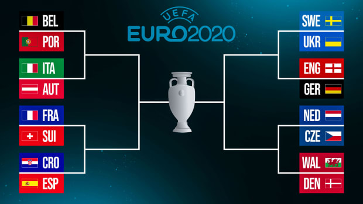
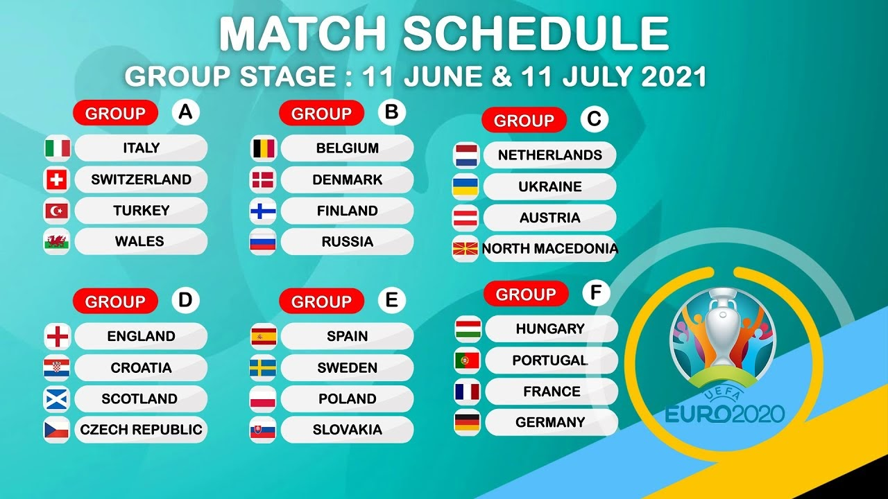

## Euro 2020

### Playoff stage



#### Bets, 1/8
```
-> Parsing playoffs/bets/Playoffs-1.csv

Player: anthony.belyaev
  game: 37) Wales vs Denmark	predicted: 1-0, actual: 0-4 -> points: 0
  game: 38) Italy vs Austria	predicted: 2-0, actual: 2-1 -> points: 1
  game: 39) Netherlands vs Czech	predicted: 2-0, actual: 0-2 -> points: 0
  game: 40) Belgium vs Portugal	predicted: 1-2, actual: 1-0 -> points: 0
  game: 41) Croatia vs Spain	predicted: 1-2, actual: 3-5 -> points: 1
  game: 42) France vs Switzerland	predicted: 3-0, actual: 3-3 Switzerland -> points: 0
  game: 43) England vs Germany	predicted: 0-1, actual: 2-0 -> points: 0
  game: 44) Sweden vs Ukraine	predicted: 0-1, actual: 1-2 -> points: 2
  score -> 4
Player: peter.jurkovic
  game: 37) Wales vs Denmark	predicted: 1-1, actual: 0-4 -> points: 0
  game: 38) Italy vs Austria	predicted: 2-1, actual: 2-1 -> points: 3
  game: 39) Netherlands vs Czech	predicted: 2-1, actual: 0-2 -> points: 0
  game: 40) Belgium vs Portugal	predicted: 0-2, actual: 1-0 -> points: 0
  game: 41) Croatia vs Spain	predicted: 1-1, actual: 3-5 -> points: 0
  game: 42) France vs Switzerland	predicted: 2-1, actual: 3-3 Switzerland -> points: 0
  game: 43) England vs Germany	predicted: 2-2, actual: 2-0 -> points: 0
  game: 44) Sweden vs Ukraine	predicted: 1-1, actual: 1-2 -> points: 0
  score -> 3
Player: stuart.mackellar
  game: 37) Wales vs Denmark	predicted: 2-1, actual: 0-4 -> points: 0
  game: 38) Italy vs Austria	predicted: 3-0, actual: 2-1 -> points: 1
  game: 39) Netherlands vs Czech	predicted: 2-0, actual: 0-2 -> points: 0
  game: 40) Belgium vs Portugal	predicted: 2-1, actual: 1-0 -> points: 2
  game: 41) Croatia vs Spain	predicted: 1-1, actual: 3-5 -> points: 0
  game: 42) France vs Switzerland	predicted: 1-0, actual: 3-3 Switzerland -> points: 0
  game: 43) England vs Germany	predicted: 1-1, actual: 2-0 -> points: 0
  game: 44) Sweden vs Ukraine	predicted: 1-1, actual: 1-2 -> points: 0
  score -> 3
Player: anton.alechnovic
  game: 37) Wales vs Denmark	predicted: 2:1, actual: 0-4 -> points: 0
  game: 38) Italy vs Austria	predicted: 3:2, actual: 2-1 -> points: 2
  game: 39) Netherlands vs Czech	predicted: 3:1, actual: 0-2 -> points: 0
  game: 40) Belgium vs Portugal	predicted: 2:2, actual: 1-0 -> points: 0
  game: 41) Croatia vs Spain	predicted: 2:3, actual: 3-5 -> points: 1
  game: 42) France vs Switzerland	predicted: 3:0, actual: 3-3 Switzerland -> points: 0
  game: 43) England vs Germany	predicted: 0:2, actual: 2-0 -> points: 0
  game: 44) Sweden vs Ukraine	predicted: 2:1, actual: 1-2 -> points: 0
  score -> 3
Player: leon.patmore
  game: 37) Wales vs Denmark	predicted: 1-1 Wales, actual: 0-4 -> points: 0
  game: 38) Italy vs Austria	predicted: 2-0, actual: 2-1 -> points: 1
  game: 39) Netherlands vs Czech	predicted: 1-0, actual: 0-2 -> points: 0
  game: 40) Belgium vs Portugal	predicted: 0-1, actual: 1-0 -> points: 0
  game: 41) Croatia vs Spain	predicted: 2-2 Spain, actual: 3-5 -> points: 1
  game: 42) France vs Switzerland	predicted: 2-0, actual: 3-3 Switzerland -> points: 0
  game: 43) England vs Germany	predicted: 1-0, actual: 2-0 -> points: 1
  game: 44) Sweden vs Ukraine	predicted: 1-0, actual: 1-2 -> points: 0
  score -> 3
Player: aurelien.favre
  game: 37) Wales vs Denmark	predicted: 1-1 Wales, actual: 0-4 -> points: 0
  game: 38) Italy vs Austria	predicted: 3-1, actual: 2-1 -> points: 1
  game: 39) Netherlands vs Czech	predicted: 1-1 Netherland, actual: 0-2 -> points: 0
  game: 40) Belgium vs Portugal	predicted: 3-1, actual: 1-0 -> points: 1
  game: 41) Croatia vs Spain	predicted: 0-0 Croatia, actual: 3-5 -> points: 0
  game: 42) France vs Switzerland	predicted: 2-0, actual: 3-3 Switzerland -> points: 0
  game: 43) England vs Germany	predicted: 2-1, actual: 2-0 -> points: 1
  game: 44) Sweden vs Ukraine	predicted: 1-0, actual: 1-2 -> points: 0
  score -> 3
Player: dylan.basdeo
  game: 37) Wales vs Denmark	predicted: 1-2, actual: 0-4 -> points: 1
  game: 38) Italy vs Austria	predicted: 3-1, actual: 2-1 -> points: 1
  game: 39) Netherlands vs Czech	predicted: 2-1, actual: 0-2 -> points: 0
  game: 40) Belgium vs Portugal	predicted: 3-2, actual: 1-0 -> points: 2
  game: 41) Croatia vs Spain	predicted: 2-2 spain, actual: 3-5 -> points: 1
  game: 42) France vs Switzerland	predicted: 2-0, actual: 3-3 Switzerland -> points: 0
  game: 43) England vs Germany	predicted: 1-1 england, actual: 2-0 -> points: 1
  game: 44) Sweden vs Ukraine	predicted: 0-0 sweden, actual: 1-2 -> points: 0
  score -> 6
Player: muhammadusama.malik
  game: 37) Wales vs Denmark bet was not placed
  game: 38) Italy vs Austria bet was not placed
  game: 39) Netherlands vs Czech bet was not placed
  game: 40) Belgium vs Portugal bet was not placed
  game: 41) Croatia vs Spain	predicted: 1-2, actual: 3-5 -> points: 1
  game: 42) France vs Switzerland	predicted: 1-0, actual: 3-3 Switzerland -> points: 0
  game: 43) England vs Germany	predicted: 1-1, actual: 2-0 -> points: 0
  game: 44) Sweden vs Ukraine	predicted: 2-0, actual: 1-2 -> points: 0
  score -> 1
Player: molly.woo
  game: 37) Wales vs Denmark bet was not placed
  game: 38) Italy vs Austria bet was not placed
  game: 39) Netherlands vs Czech bet was not placed
  game: 40) Belgium vs Portugal bet was not placed
  game: 41) Croatia vs Spain	predicted: 0-2, actual: 3-5 -> points: 2
  game: 42) France vs Switzerland	predicted: 0-0, actual: 3-3 Switzerland -> points: 1
  game: 43) England vs Germany	predicted: 1-1, actual: 2-0 -> points: 0
  game: 44) Sweden vs Ukraine	predicted: 1-0, actual: 1-2 -> points: 0
  score -> 3
```


### Group stage



#### Bets, day 4
```
-> Parsing bets/Group-stage-4.csv

Player: peter.jurkovic
  game: 31) 🇨🇿Czech Republic vs England 🏴󠁧󠁢󠁥󠁮󠁧󠁿 	predicted: 1-1, actual: 0-1 -> points: 0
  game: 32) 🇭🇷Croatia vs Scotland 🏴󠁧󠁢󠁳󠁣󠁴󠁿 	predicted: 2-1, actual: 3-1 -> points: 1
  game: 33) 🇸🇰 Slovakia vs Spain 🇪🇸 	predicted: 0-2, actual: 0-5 -> points: 1
  game: 34) 🇸🇪 Sweden vs Poland 🇵🇱 	predicted: 1-1, actual: 3-2 -> points: 0
  game: 35) 🇩🇪 Germany vs Hungary 🇭🇺 	predicted: 2-0, actual: 2-2 -> points: 0
  game: 36) 🇵🇹 Portugal vs France 🇫🇷	predicted: 1-1, actual: 2-2 -> points: 2
  score -> 4
Player: anthony.belyaev
  game: 31) 🇨🇿Czech Republic vs England 🏴󠁧󠁢󠁥󠁮󠁧󠁿 	predicted: 0-2, actual: 0-1 -> points: 1
  game: 32) 🇭🇷Croatia vs Scotland 🏴󠁧󠁢󠁳󠁣󠁴󠁿 	predicted: 1-0, actual: 3-1 -> points: 1
  game: 33) 🇸🇰 Slovakia vs Spain 🇪🇸 	predicted: 0-1, actual: 0-5 -> points: 1
  game: 34) 🇸🇪 Sweden vs Poland 🇵🇱 	predicted: 0-0, actual: 3-2 -> points: 0
  game: 35) 🇩🇪 Germany vs Hungary 🇭🇺 	predicted: 2-0, actual: 2-2 -> points: 0
  game: 36) 🇵🇹 Portugal vs France 🇫🇷	predicted: 1-2, actual: 2-2 -> points: 0
  score -> 3
Player: leon.patmore
  game: 31) 🇨🇿Czech Republic vs England 🏴󠁧󠁢󠁥󠁮󠁧󠁿 	predicted: 0-2, actual: 0-1 -> points: 1
  game: 32) 🇭🇷Croatia vs Scotland 🏴󠁧󠁢󠁳󠁣󠁴󠁿 	predicted: 1-0, actual: 3-1 -> points: 1
  game: 33) 🇸🇰 Slovakia vs Spain 🇪🇸 	predicted: 0-2, actual: 0-5 -> points: 1
  game: 34) 🇸🇪 Sweden vs Poland 🇵🇱 	predicted: 0-0, actual: 3-2 -> points: 0
  game: 35) 🇩🇪 Germany vs Hungary 🇭🇺 	predicted: 2-0, actual: 2-2 -> points: 0
  game: 36) 🇵🇹 Portugal vs France 🇫🇷	predicted: 1-0, actual: 2-2 -> points: 0
  score -> 3
Player: anton.alechnovic
  game: 31) 🇨🇿Czech Republic vs England 🏴󠁧󠁢󠁥󠁮󠁧󠁿 	predicted: 1:1, actual: 0-1 -> points: 0
  game: 32) 🇭🇷Croatia vs Scotland 🏴󠁧󠁢󠁳󠁣󠁴󠁿 	predicted: 3:0, actual: 3-1 -> points: 1
  game: 33) 🇸🇰 Slovakia vs Spain 🇪🇸 	predicted: 1:2, actual: 0-5 -> points: 1
  game: 34) 🇸🇪 Sweden vs Poland 🇵🇱 	predicted: 2:2, actual: 3-2 -> points: 0
  game: 35) 🇩🇪 Germany vs Hungary 🇭🇺 	predicted: 3:1, actual: 2-2 -> points: 0
  game: 36) 🇵🇹 Portugal vs France 🇫🇷	predicted: 2:5, actual: 2-2 -> points: 0
  score -> 2
Player: stuart.mackellar
  game: 31) 🇨🇿Czech Republic vs England 🏴󠁧󠁢󠁥󠁮󠁧󠁿 	predicted: 1-1, actual: 0-1 -> points: 0
  game: 32) 🇭🇷Croatia vs Scotland 🏴󠁧󠁢󠁳󠁣󠁴󠁿 	predicted: 0-0, actual: 3-1 -> points: 0
  game: 33) 🇸🇰 Slovakia vs Spain 🇪🇸 	predicted: 0-2, actual: 0-5 -> points: 1
  game: 34) 🇸🇪 Sweden vs Poland 🇵🇱 	predicted: 1-1, actual: 3-2 -> points: 0
  game: 35) 🇩🇪 Germany vs Hungary 🇭🇺 	predicted: 3-0, actual: 2-2 -> points: 0
  game: 36) 🇵🇹 Portugal vs France 🇫🇷	predicted: 0-2, actual: 2-2 -> points: 0
  score -> 1
Player: aurelien.favre
  game: 31) 🇨🇿Czech Republic vs England 🏴󠁧󠁢󠁥󠁮󠁧󠁿 	predicted: 0-2, actual: 0-1 -> points: 1
  game: 32) 🇭🇷Croatia vs Scotland 🏴󠁧󠁢󠁳󠁣󠁴󠁿 	predicted: 1-0, actual: 3-1 -> points: 1
  game: 33) 🇸🇰 Slovakia vs Spain 🇪🇸 	predicted: 1-1, actual: 0-5 -> points: 0
  game: 34) 🇸🇪 Sweden vs Poland 🇵🇱 	predicted: 2-1, actual: 3-2 -> points: 2
  game: 35) 🇩🇪 Germany vs Hungary 🇭🇺 	predicted: 3-0, actual: 2-2 -> points: 0
  game: 36) 🇵🇹 Portugal vs France 🇫🇷	predicted: 1-2, actual: 2-2 -> points: 0
  score -> 4
Player: dylan.basdeo
  game: 31) 🇨🇿Czech Republic vs England 🏴󠁧󠁢󠁥󠁮󠁧󠁿  bet was not placed
  game: 32) 🇭🇷Croatia vs Scotland 🏴󠁧󠁢󠁳󠁣󠁴󠁿  bet was not placed
  game: 33) 🇸🇰 Slovakia vs Spain 🇪🇸 	predicted: 1-3, actual: 0-5 -> points: 1
  game: 34) 🇸🇪 Sweden vs Poland 🇵🇱 	predicted: 1-1, actual: 3-2 -> points: 0
  game: 35) 🇩🇪 Germany vs Hungary 🇭🇺 	predicted: 2-0, actual: 2-2 -> points: 0
  game: 36) 🇵🇹 Portugal vs France 🇫🇷	predicted: 1-2, actual: 2-2 -> points: 0
  score -> 1
Player: molly.woo
  game: 31) 🇨🇿Czech Republic vs England 🏴󠁧󠁢󠁥󠁮󠁧󠁿 	predicted: 0-2, actual: 0-1 -> points: 1
  game: 32) 🇭🇷Croatia vs Scotland 🏴󠁧󠁢󠁳󠁣󠁴󠁿 	predicted: 0-1, actual: 3-1 -> points: 0
  game: 33) 🇸🇰 Slovakia vs Spain 🇪🇸 	predicted: 0-1, actual: 0-5 -> points: 1
  game: 34) 🇸🇪 Sweden vs Poland 🇵🇱 	predicted: 0-0, actual: 3-2 -> points: 0
  game: 35) 🇩🇪 Germany vs Hungary 🇭🇺 	predicted: 1-1, actual: 2-2 -> points: 2
  game: 36) 🇵🇹 Portugal vs France 🇫🇷	predicted: 1-1, actual: 2-2 -> points: 2
  score -> 6
```

#### Bets, day 3
```
-> Parsing bets/Group-stage-3.csv

Player: anthony.belyaev
  game: 19) 🇸🇪Sweden vs Slovakia 🇸🇰	predicted: 0-0, actual: 1-0 -> points: 0
  game: 20) 🇭🇷Croatia vs Czech Republic 🇨🇿	predicted: 0-0, actual: 1-1 -> points: 2
  game: 21) 🏴󠁧󠁢󠁥󠁮󠁧󠁿England vs Scotland 🏴󠁧󠁢󠁳󠁣󠁴󠁿	predicted: 0-0, actual: 0-0 -> points: 3
  game: 22) 🇭🇺Hungary vs France 🇫🇷	predicted: 0-0, actual: 1-1 -> points: 2
  game: 23) 🇵🇹Portugal vs Germany 🇩🇪	predicted: 0-1, actual: 2-4 -> points: 1
  game: 24) 🇪🇸Spain vs Poland 🇵🇱	predicted: 0-0, actual: 1-1 -> points: 2
  game: 25) 🇮🇹Italy vs Wales 🏴󠁧󠁢󠁷󠁬󠁳󠁿	predicted: 2-1, actual: 1-0 -> points: 2
  game: 26)🇨🇭Switzerland vs Turkey 🇹🇷	predicted: 1-0, actual: 3-1 -> points: 1
  game: 27) 🇲🇰North Macedonia vs Netherlands 🇳🇱	predicted: 0-2, actual: 0-3 -> points: 1
  game: 28) 🇺🇦Ukraine vs Austria 🦘	predicted: 1-1, actual: 0-1 -> points: 0
  game: 29) 🇷🇺Russia vs Denmark 🇩🇰	predicted: 1-2, actual: 1-4 -> points: 1
  game: 30) 🇫🇮Finland vs Belgium 🇧🇪	predicted: 0-3, actual: 0-2 -> points: 1
  score -> 16
Player: anton.alechnovic
  game: 19) 🇸🇪Sweden vs Slovakia 🇸🇰	predicted: 2-2, actual: 1-0 -> points: 0
  game: 20) 🇭🇷Croatia vs Czech Republic 🇨🇿	predicted: 2-1, actual: 1-1 -> points: 0
  game: 21) 🏴󠁧󠁢󠁥󠁮󠁧󠁿England vs Scotland 🏴󠁧󠁢󠁳󠁣󠁴󠁿	predicted: 3-1, actual: 0-0 -> points: 0
  game: 22) 🇭🇺Hungary vs France 🇫🇷	predicted: 0-3, actual: 1-1 -> points: 0
  game: 23) 🇵🇹Portugal vs Germany 🇩🇪	predicted: 1-2, actual: 2-4 -> points: 1
  game: 24) 🇪🇸Spain vs Poland 🇵🇱	predicted: 2-0, actual: 1-1 -> points: 0
  game: 25) 🇮🇹Italy vs Wales 🏴󠁧󠁢󠁷󠁬󠁳󠁿	predicted: 2-1, actual: 1-0 -> points: 2
  game: 26)🇨🇭Switzerland vs Turkey 🇹🇷	predicted: 1-1, actual: 3-1 -> points: 0
  game: 27) 🇲🇰North Macedonia vs Netherlands 🇳🇱	predicted: 0-3, actual: 0-3 -> points: 3
  game: 28) 🇺🇦Ukraine vs Austria 🦘	predicted: 2-1, actual: 0-1 -> points: 0
  game: 29) 🇷🇺Russia vs Denmark 🇩🇰	predicted: 2-0, actual: 1-4 -> points: 0
  game: 30) 🇫🇮Finland vs Belgium 🇧🇪	predicted: 0-2, actual: 0-2 -> points: 3
  score -> 9
Player: peter.jurkovic
  game: 19) 🇸🇪Sweden vs Slovakia 🇸🇰	predicted: 2-1, actual: 1-0 -> points: 2
  game: 20) 🇭🇷Croatia vs Czech Republic 🇨🇿	predicted: 2-2, actual: 1-1 -> points: 2
  game: 21) 🏴󠁧󠁢󠁥󠁮󠁧󠁿England vs Scotland 🏴󠁧󠁢󠁳󠁣󠁴󠁿	predicted: 3-0, actual: 0-0 -> points: 0
  game: 22) 🇭🇺Hungary vs France 🇫🇷	predicted: 0-3, actual: 1-1 -> points: 0
  game: 23) 🇵🇹Portugal vs Germany 🇩🇪	predicted: 2-1, actual: 2-4 -> points: 0
  game: 24) 🇪🇸Spain vs Poland 🇵🇱	predicted: 3-1, actual: 1-1 -> points: 0
  game: 25) 🇮🇹Italy vs Wales 🏴󠁧󠁢󠁷󠁬󠁳󠁿	predicted: 2-1, actual: 1-0 -> points: 2
  game: 26)🇨🇭Switzerland vs Turkey 🇹🇷	predicted: 1-0, actual: 3-1 -> points: 1
  game: 27) 🇲🇰North Macedonia vs Netherlands 🇳🇱	predicted: 0-2, actual: 0-3 -> points: 1
  game: 28) 🇺🇦Ukraine vs Austria 🦘	predicted: 1-1, actual: 0-1 -> points: 0
  game: 29) 🇷🇺Russia vs Denmark 🇩🇰	predicted: 1-0, actual: 1-4 -> points: 0
  game: 30) 🇫🇮Finland vs Belgium 🇧🇪	predicted: 2-2, actual: 0-2 -> points: 0
  score -> 8
Player: molly.woo
  game: 19) 🇸🇪Sweden vs Slovakia 🇸🇰	predicted: 2-1, actual: 1-0 -> points: 2
  game: 20) 🇭🇷Croatia vs Czech Republic 🇨🇿	predicted: 0-2, actual: 1-1 -> points: 0
  game: 21) 🏴󠁧󠁢󠁥󠁮󠁧󠁿England vs Scotland 🏴󠁧󠁢󠁳󠁣󠁴󠁿	predicted: 1-0, actual: 0-0 -> points: 0
  game: 22) 🇭🇺Hungary vs France 🇫🇷	predicted: 0-0, actual: 1-1 -> points: 2
  game: 23) 🇵🇹Portugal vs Germany 🇩🇪	predicted: 1-2, actual: 2-4 -> points: 1
  game: 24) 🇪🇸Spain vs Poland 🇵🇱	predicted: 2-0, actual: 1-1 -> points: 0
  game: 25) 🇮🇹Italy vs Wales 🏴󠁧󠁢󠁷󠁬󠁳󠁿	predicted: 1-2, actual: 1-0 -> points: 0
  game: 26)🇨🇭Switzerland vs Turkey 🇹🇷	predicted: 1-0, actual: 3-1 -> points: 1
  game: 27) 🇲🇰North Macedonia vs Netherlands 🇳🇱	predicted: 0-1, actual: 0-3 -> points: 1
  game: 28) 🇺🇦Ukraine vs Austria 🦘	predicted: 0-1, actual: 0-1 -> points: 3
  game: 29) 🇷🇺Russia vs Denmark 🇩🇰	predicted: 0-1, actual: 1-4 -> points: 1
  game: 30) 🇫🇮Finland vs Belgium 🇧🇪	predicted: 1-1, actual: 0-2 -> points: 0
  score -> 11
Player: leon.patmore
  game: 19) 🇸🇪Sweden vs Slovakia 🇸🇰	predicted: 0-1, actual: 1-0 -> points: 0
  game: 20) 🇭🇷Croatia vs Czech Republic 🇨🇿	predicted: 2-2, actual: 1-1 -> points: 2
  game: 21) 🏴󠁧󠁢󠁥󠁮󠁧󠁿England vs Scotland 🏴󠁧󠁢󠁳󠁣󠁴󠁿	predicted: 100-0, actual: 0-0 -> points: 0
  game: 22) 🇭🇺Hungary vs France 🇫🇷	predicted: 0-3, actual: 1-1 -> points: 0
  game: 23) 🇵🇹Portugal vs Germany 🇩🇪	predicted: 2-1, actual: 2-4 -> points: 0
  game: 24) 🇪🇸Spain vs Poland 🇵🇱	predicted: 1-0, actual: 1-1 -> points: 0
  game: 25) 🇮🇹Italy vs Wales 🏴󠁧󠁢󠁷󠁬󠁳󠁿	predicted: 1-0, actual: 1-0 -> points: 3
  game: 26)🇨🇭Switzerland vs Turkey 🇹🇷	predicted: 0-0, actual: 3-1 -> points: 0
  game: 27) 🇲🇰North Macedonia vs Netherlands 🇳🇱	predicted: 0-2, actual: 0-3 -> points: 1
  game: 28) 🇺🇦Ukraine vs Austria 🦘	predicted: 0-2, actual: 0-1 -> points: 1
  game: 29) 🇷🇺Russia vs Denmark 🇩🇰	predicted: 0-0, actual: 1-4 -> points: 0
  game: 30) 🇫🇮Finland vs Belgium 🇧🇪	predicted: 0-1, actual: 0-2 -> points: 1
  score -> 8
Player: dylan.basdeo
  game: 19) 🇸🇪Sweden vs Slovakia 🇸🇰	predicted: 1-1, actual: 1-0 -> points: 0
  game: 20) 🇭🇷Croatia vs Czech Republic 🇨🇿	predicted: 1-0, actual: 1-1 -> points: 0
  game: 21) 🏴󠁧󠁢󠁥󠁮󠁧󠁿England vs Scotland 🏴󠁧󠁢󠁳󠁣󠁴󠁿	predicted: 2-0, actual: 0-0 -> points: 0
  game: 22) 🇭🇺Hungary vs France 🇫🇷	predicted: 0-3, actual: 1-1 -> points: 0
  game: 23) 🇵🇹Portugal vs Germany 🇩🇪	predicted: 1-1, actual: 2-4 -> points: 0
  game: 24) 🇪🇸Spain vs Poland 🇵🇱	predicted: 2-1, actual: 1-1 -> points: 0
  game: 25) 🇮🇹Italy vs Wales 🏴󠁧󠁢󠁷󠁬󠁳󠁿	predicted: 2-1, actual: 1-0 -> points: 2
  game: 26)🇨🇭Switzerland vs Turkey 🇹🇷	predicted: 1-0, actual: 3-1 -> points: 1
  game: 27) 🇲🇰North Macedonia vs Netherlands 🇳🇱	predicted: 0-3, actual: 0-3 -> points: 3
  game: 28) 🇺🇦Ukraine vs Austria 🦘	predicted: 1-2, actual: 0-1 -> points: 2
  game: 29) 🇷🇺Russia vs Denmark 🇩🇰	predicted: 1-1, actual: 1-4 -> points: 0
  game: 30) 🇫🇮Finland vs Belgium 🇧🇪	predicted: 0-3, actual: 0-2 -> points: 1
  score -> 9
Player: stuart.mackellar
  game: 19) 🇸🇪Sweden vs Slovakia 🇸🇰	predicted: 1-0, actual: 1-0 -> points: 3
  game: 20) 🇭🇷Croatia vs Czech Republic 🇨🇿	predicted: 1-1, actual: 1-1 -> points: 3
  game: 21) 🏴󠁧󠁢󠁥󠁮󠁧󠁿England vs Scotland 🏴󠁧󠁢󠁳󠁣󠁴󠁿	predicted: 2-0, actual: 0-0 -> points: 0
  game: 22) 🇭🇺Hungary vs France 🇫🇷	predicted: 0-3, actual: 1-1 -> points: 0
  game: 23) 🇵🇹Portugal vs Germany 🇩🇪	predicted: 1-1, actual: 2-4 -> points: 0
  game: 24) 🇪🇸Spain vs Poland 🇵🇱	predicted: 3-0, actual: 1-1 -> points: 0
  game: 25) 🇮🇹Italy vs Wales 🏴󠁧󠁢󠁷󠁬󠁳󠁿	predicted: 1-1, actual: 1-0 -> points: 0
  game: 26)🇨🇭Switzerland vs Turkey 🇹🇷	predicted: 0-0, actual: 3-1 -> points: 0
  game: 27) 🇲🇰North Macedonia vs Netherlands 🇳🇱	predicted: 0-3, actual: 0-3 -> points: 3
  game: 28) 🇺🇦Ukraine vs Austria 🦘	predicted: 1-0, actual: 0-1 -> points: 0
  game: 29) 🇷🇺Russia vs Denmark 🇩🇰	predicted: 1-0, actual: 1-4 -> points: 0
  game: 30) 🇫🇮Finland vs Belgium 🇧🇪	predicted: 0-2, actual: 0-2 -> points: 3
  score -> 12
Player: aurelien.favre
  game: 19) 🇸🇪Sweden vs Slovakia 🇸🇰	predicted: 2-1, actual: 1-0 -> points: 2
  game: 20) 🇭🇷Croatia vs Czech Republic 🇨🇿	predicted: 2-1, actual: 1-1 -> points: 0
  game: 21) 🏴󠁧󠁢󠁥󠁮󠁧󠁿England vs Scotland 🏴󠁧󠁢󠁳󠁣󠁴󠁿	predicted: 3-1, actual: 0-0 -> points: 0
  game: 22) 🇭🇺Hungary vs France 🇫🇷	predicted: 0-3, actual: 1-1 -> points: 0
  game: 23) 🇵🇹Portugal vs Germany 🇩🇪	predicted: 2-2, actual: 2-4 -> points: 0
  game: 24) 🇪🇸Spain vs Poland 🇵🇱	predicted: 1-0, actual: 1-1 -> points: 0
  game: 25) 🇮🇹Italy vs Wales 🏴󠁧󠁢󠁷󠁬󠁳󠁿	predicted: 3-1, actual: 1-0 -> points: 1
  game: 26)🇨🇭Switzerland vs Turkey 🇹🇷	predicted: 1-0, actual: 3-1 -> points: 1
  game: 27) 🇲🇰North Macedonia vs Netherlands 🇳🇱	predicted: 0-2, actual: 0-3 -> points: 1
  game: 28) 🇺🇦Ukraine vs Austria 🦘	predicted: 1-1, actual: 0-1 -> points: 0
  game: 29) 🇷🇺Russia vs Denmark 🇩🇰	predicted: 1-2, actual: 1-4 -> points: 1
  game: 30) 🇫🇮Finland vs Belgium 🇧🇪	predicted: 1-3, actual: 0-2 -> points: 2
  score -> 8
```

#### Bets, day 2
```
-> Parsing bets/Group-stage-2.csv

Player: anthony.belyaev
  game: 11) 🇭🇺Hungary vs Portugal 🇵🇹 	predicted: 0-2, actual: 0-3 -> points: 1
  game: 12) 🇫🇷 France vs Germany 🇩🇪	predicted: 2-1, actual: 1-0 -> points: 2
  game: 13) 🇫🇮Finland vs Russia 🇷🇺	predicted: 1-1, actual: 0-1 -> points: 0
  game: 14) 🇹🇷 Turkey vs Wales 🏴󠁧󠁢󠁷󠁬󠁳󠁿	predicted: 0-2, actual: 0-2 -> points: 3
  game: 15) 🇮🇹Italy vs Switzerland 🇨🇭	predicted: 2-0, actual: 3-0 -> points: 1
  game: 16) 🇺🇦 Ukraine vs North Macedonia 🇲🇰	predicted: 2-1, actual: 2-1 -> points: 3
  game: 17) 🇩🇰 Denmark vs Belgium 🇧🇪 	predicted: 0-2, actual: 1-2 -> points: 1
  game: 18) 🇳🇱 Netherlands vs Austria 🇦🇺	predicted: 2-0, actual: 2-0 -> points: 3
  score -> 14
Player: peter.jurkovic
  game: 11) 🇭🇺Hungary vs Portugal 🇵🇹 	predicted: 1-2, actual: 0-3 -> points: 1
  game: 12) 🇫🇷 France vs Germany 🇩🇪	predicted: 0-1, actual: 1-0 -> points: 0
  game: 13) 🇫🇮Finland vs Russia 🇷🇺	predicted: 1-1, actual: 0-1 -> points: 0
  game: 14) 🇹🇷 Turkey vs Wales 🏴󠁧󠁢󠁷󠁬󠁳󠁿	predicted: 2-1, actual: 0-2 -> points: 0
  game: 15) 🇮🇹Italy vs Switzerland 🇨🇭	predicted: 1-2, actual: 3-0 -> points: 0
  game: 16) 🇺🇦 Ukraine vs North Macedonia 🇲🇰	predicted: 2-2, actual: 2-1 -> points: 0
  game: 17) 🇩🇰 Denmark vs Belgium 🇧🇪 	predicted: 1-2, actual: 1-2 -> points: 3
  game: 18) 🇳🇱 Netherlands vs Austria 🇦🇺	predicted: 3-1, actual: 2-0 -> points: 2
  score -> 6
Player: leon.patmore
  game: 11) 🇭🇺Hungary vs Portugal 🇵🇹 	predicted: 1-2, actual: 0-3 -> points: 1
  game: 12) 🇫🇷 France vs Germany 🇩🇪	predicted: 2-1, actual: 1-0 -> points: 2
  game: 13) 🇫🇮Finland vs Russia 🇷🇺	predicted: 0-0, actual: 0-1 -> points: 0
  game: 14) 🇹🇷 Turkey vs Wales 🏴󠁧󠁢󠁷󠁬󠁳󠁿	predicted: 0-1, actual: 0-2 -> points: 1
  game: 15) 🇮🇹Italy vs Switzerland 🇨🇭	predicted: 2-0, actual: 3-0 -> points: 1
  game: 16) 🇺🇦 Ukraine vs North Macedonia 🇲🇰	predicted: 3-0, actual: 2-1 -> points: 1
  game: 17) 🇩🇰 Denmark vs Belgium 🇧🇪 	predicted: 0-3, actual: 1-2 -> points: 1
  game: 18) 🇳🇱 Netherlands vs Austria 🇦🇺	predicted: 1-0, actual: 2-0 -> points: 1
  score -> 8
Player: stuart.mackellar
  game: 11) 🇭🇺Hungary vs Portugal 🇵🇹 	predicted: 0-2, actual: 0-3 -> points: 1
  game: 12) 🇫🇷 France vs Germany 🇩🇪	predicted: 1-1, actual: 1-0 -> points: 0
  game: 13) 🇫🇮Finland vs Russia 🇷🇺	predicted: 1-0, actual: 0-1 -> points: 0
  game: 14) 🇹🇷 Turkey vs Wales 🏴󠁧󠁢󠁷󠁬󠁳󠁿	predicted: 0-1, actual: 0-2 -> points: 1
  game: 15) 🇮🇹Italy vs Switzerland 🇨🇭	predicted: 0-0, actual: 3-0 -> points: 0
  game: 16) 🇺🇦 Ukraine vs North Macedonia 🇲🇰	predicted: 3-0, actual: 2-1 -> points: 1
  game: 17) 🇩🇰 Denmark vs Belgium 🇧🇪 	predicted: 0-2, actual: 1-2 -> points: 1
  game: 18) 🇳🇱 Netherlands vs Austria 🇦🇺	predicted: 1-0, actual: 2-0 -> points: 1
  score -> 5
Player: dylan.basdeo
  game: 11) 🇭🇺Hungary vs Portugal 🇵🇹 	predicted: 0-2, actual: 0-3 -> points: 1
  game: 12) 🇫🇷 France vs Germany 🇩🇪	predicted: 2-1, actual: 1-0 -> points: 2
  game: 13) 🇫🇮Finland vs Russia 🇷🇺	predicted: 1-0, actual: 0-1 -> points: 0
  game: 14) 🇹🇷 Turkey vs Wales 🏴󠁧󠁢󠁷󠁬󠁳󠁿	predicted: 0-1, actual: 0-2 -> points: 1
  game: 15) 🇮🇹Italy vs Switzerland 🇨🇭	predicted: 1-1, actual: 3-0 -> points: 0
  game: 16) 🇺🇦 Ukraine vs North Macedonia 🇲🇰	predicted: 2-1, actual: 2-1 -> points: 3
  game: 17) 🇩🇰 Denmark vs Belgium 🇧🇪 	predicted: 1-3, actual: 1-2 -> points: 1
  game: 18) 🇳🇱 Netherlands vs Austria 🇦🇺	predicted: 2-1, actual: 2-0 -> points: 1
  score -> 9
Player: anton.alechnovic
  game: 11) 🇭🇺Hungary vs Portugal 🇵🇹 	predicted: 0-1, actual: 0-3 -> points: 1
  game: 12) 🇫🇷 France vs Germany 🇩🇪	predicted: 3-1, actual: 1-0 -> points: 1
  game: 13) 🇫🇮Finland vs Russia 🇷🇺	predicted: 1-2, actual: 0-1 -> points: 2
  game: 14) 🇹🇷 Turkey vs Wales 🏴󠁧󠁢󠁷󠁬󠁳󠁿	predicted: 0-1, actual: 0-2 -> points: 1
  game: 15) 🇮🇹Italy vs Switzerland 🇨🇭	predicted: 2-0, actual: 3-0 -> points: 1
  game: 16) 🇺🇦 Ukraine vs North Macedonia 🇲🇰	predicted: 2-0, actual: 2-1 -> points: 1
  game: 17) 🇩🇰 Denmark vs Belgium 🇧🇪 	predicted: 1-3, actual: 1-2 -> points: 1
  game: 18) 🇳🇱 Netherlands vs Austria 🇦🇺	predicted: 2-0, actual: 2-0 -> points: 3
  score -> 11
Player: muhammadusama.malik
  game: 11) 🇭🇺Hungary vs Portugal 🇵🇹 	predicted: 2-0, actual: 0-3 -> points: 0
  game: 12) 🇫🇷 France vs Germany 🇩🇪	predicted: 1-1, actual: 1-0 -> points: 0
  game: 13) 🇫🇮Finland vs Russia 🇷🇺	predicted: 0-2, actual: 0-1 -> points: 1
  game: 14) 🇹🇷 Turkey vs Wales 🏴󠁧󠁢󠁷󠁬󠁳󠁿	predicted: 1-1, actual: 0-2 -> points: 0
  game: 15) 🇮🇹Italy vs Switzerland 🇨🇭	predicted: 2-1, actual: 3-0 -> points: 1
  game: 16) 🇺🇦 Ukraine vs North Macedonia 🇲🇰	predicted: 1-0, actual: 2-1 -> points: 2
  game: 17) 🇩🇰 Denmark vs Belgium 🇧🇪 	predicted: 0-2, actual: 1-2 -> points: 1
  game: 18) 🇳🇱 Netherlands vs Austria 🇦🇺	predicted: 1-0, actual: 2-0 -> points: 1
  score -> 6
Player: aurelien.favre
  game: 11) 🇭🇺Hungary vs Portugal 🇵🇹 	predicted: 0-2, actual: 0-3 -> points: 1
  game: 12) 🇫🇷 France vs Germany 🇩🇪	predicted: 2-1, actual: 1-0 -> points: 2
  game: 13) 🇫🇮Finland vs Russia 🇷🇺	predicted: 0-0, actual: 0-1 -> points: 0
  game: 14) 🇹🇷 Turkey vs Wales 🏴󠁧󠁢󠁷󠁬󠁳󠁿	predicted: 2-1, actual: 0-2 -> points: 0
  game: 15) 🇮🇹Italy vs Switzerland 🇨🇭	predicted: 3-1, actual: 3-0 -> points: 1
  game: 16) 🇺🇦 Ukraine vs North Macedonia 🇲🇰	predicted: 1-0, actual: 2-1 -> points: 2
  game: 17) 🇩🇰 Denmark vs Belgium 🇧🇪 	predicted: 1-3, actual: 1-2 -> points: 1
  game: 18) 🇳🇱 Netherlands vs Austria 🇦🇺	predicted: 2-1, actual: 2-0 -> points: 1
  score -> 8
Player: molly.woo
  game: 11) 🇭🇺Hungary vs Portugal 🇵🇹 	predicted: 1-1, actual: 0-3 -> points: 0
  game: 12) 🇫🇷 France vs Germany 🇩🇪	predicted: 1-2, actual: 1-0 -> points: 0
  game: 13) 🇫🇮Finland vs Russia 🇷🇺	predicted: 1-2, actual: 0-1 -> points: 2
  game: 14) 🇹🇷 Turkey vs Wales 🏴󠁧󠁢󠁷󠁬󠁳󠁿	predicted: 0-2, actual: 0-2 -> points: 3
  game: 15) 🇮🇹Italy vs Switzerland 🇨🇭	predicted: 1-1, actual: 3-0 -> points: 0
  game: 16) 🇺🇦 Ukraine vs North Macedonia 🇲🇰	predicted: 2-1, actual: 2-1 -> points: 3
  game: 17) 🇩🇰 Denmark vs Belgium 🇧🇪 	predicted: 2-3, actual: 1-2 -> points: 2
  game: 18) 🇳🇱 Netherlands vs Austria 🇦🇺	predicted: 1-2, actual: 2-0 -> points: 0
  score -> 10
```

#### Bets, day 1
```
-> Parsing bets/Group-stage-1.csv

Player: anthony.belyaev
  game: 1) Turkey vs Italy	predicted: 1-2, actual: 0-3 -> points: 1
  game: 2) Wales vs Switzerland	predicted: 3-1, actual: 1-1 -> points: 0
  game: 3) Denmark vs Finland	predicted: 2-1, actual: 0-1 -> points: 0
  game: 4) Belgium vs Russia	predicted: 2-1, actual: 3-0 -> points: 1
  game: 5) England vs Croatia	predicted: 3-1, actual: 1-0 -> points: 1
  game: 6) Austria vs North Macedonia	predicted: 2-0, actual: 3-1 -> points: 2
  game: 7) Netherlands vs Ukraine	predicted: 3-1, actual: 3-2 -> points: 1
  game: 8) Scotland vs Czech Republic	predicted: 1-3, actual: 0-2 -> points: 2
  game: 9) Poland vs Slovakia	predicted: 2-1, actual: 1-2 -> points: 0
  game: 10) Spain vs Sweden	predicted: 1-1, actual: 0-0 -> points: 2
  score -> 10
Player: dylan.basdeo
  game: 1) Turkey vs Italy	predicted: 0-2, actual: 0-3 -> points: 1
  game: 2) Wales vs Switzerland	predicted: 0-1, actual: 1-1 -> points: 0
  game: 3) Denmark vs Finland	predicted: 2-1, actual: 0-1 -> points: 0
  game: 4) Belgium vs Russia	predicted: 3-1, actual: 3-0 -> points: 1
  game: 5) England vs Croatia	predicted: 2-2, actual: 1-0 -> points: 0
  game: 6) Austria vs North Macedonia	predicted: 1-0, actual: 3-1 -> points: 1
  game: 7) Netherlands vs Ukraine	predicted: 2-0, actual: 3-2 -> points: 1
  game: 8) Scotland vs Czech Republic	predicted: 1-1, actual: 0-2 -> points: 0
  game: 9) Poland vs Slovakia	predicted: 2-0, actual: 1-2 -> points: 0
  game: 10) Spain vs Sweden	predicted: 2-1, actual: 0-0 -> points: 0
  score -> 4
Player: peter.jurkovic
  game: 1) Turkey vs Italy	predicted: 1-3, actual: 0-3 -> points: 1
  game: 2) Wales vs Switzerland	predicted: 2-2, actual: 1-1 -> points: 2
  game: 3) Denmark vs Finland	predicted: 2-2, actual: 0-1 -> points: 0
  game: 4) Belgium vs Russia	predicted: 3-1, actual: 3-0 -> points: 1
  game: 5) England vs Croatia	predicted: 2-3, actual: 1-0 -> points: 0
  game: 6) Austria vs North Macedonia	predicted: 4-1, actual: 3-1 -> points: 1
  game: 7) Netherlands vs Ukraine	predicted: 3-1, actual: 3-2 -> points: 1
  game: 8) Scotland vs Czech Republic	predicted: 1-2, actual: 0-2 -> points: 1
  game: 9) Poland vs Slovakia	predicted: 3-1, actual: 1-2 -> points: 0
  game: 10) Spain vs Sweden	predicted: 3-1, actual: 0-0 -> points: 0
  score -> 7
Player: molly.woo
  game: 1) Turkey vs Italy	predicted: 1-3, actual: 0-3 -> points: 1
  game: 2) Wales vs Switzerland	predicted: 2-2, actual: 1-1 -> points: 2
  game: 3) Denmark vs Finland	predicted: 1-1, actual: 0-1 -> points: 0
  game: 4) Belgium vs Russia	predicted: 1-2, actual: 3-0 -> points: 0
  game: 5) England vs Croatia	predicted: 3-1, actual: 1-0 -> points: 1
  game: 6) Austria vs North Macedonia	predicted: 3-1, actual: 3-1 -> points: 3
  game: 7) Netherlands vs Ukraine	predicted: 1-2, actual: 3-2 -> points: 0
  game: 8) Scotland vs Czech Republic	predicted: 2-3, actual: 0-2 -> points: 1
  game: 9) Poland vs Slovakia	predicted: 1-2, actual: 1-2 -> points: 3
  game: 10) Spain vs Sweden	predicted: 2-2, actual: 0-0 -> points: 2
  score -> 13
Player: muhammadusama.malik
  game: 1) Turkey vs Italy	predicted: 1-3, actual: 0-3 -> points: 1
  game: 2) Wales vs Switzerland	predicted: 1-2, actual: 1-1 -> points: 0
  game: 3) Denmark vs Finland	predicted: 2-0, actual: 0-1 -> points: 0
  game: 4) Belgium vs Russia	predicted: 3-1, actual: 3-0 -> points: 1
  game: 5) England vs Croatia	predicted: 2-1, actual: 1-0 -> points: 2
  game: 6) Austria vs North Macedonia	predicted: 2-0, actual: 3-1 -> points: 2
  game: 7) Netherlands vs Ukraine	predicted: 1-1, actual: 3-2 -> points: 0
  game: 8) Scotland vs Czech Republic	predicted: 1-1, actual: 0-2 -> points: 0
  game: 9) Poland vs Slovakia	predicted: 3-1, actual: 1-2 -> points: 0
  game: 10) Spain vs Sweden	predicted: 3-0, actual: 0-0 -> points: 0
  score -> 6
Player: aurelien.favre
  game: 1) Turkey vs Italy	predicted: 1-1, actual: 0-3 -> points: 0
  game: 2) Wales vs Switzerland	predicted: 0-2, actual: 1-1 -> points: 0
  game: 3) Denmark vs Finland	predicted: 0-0, actual: 0-1 -> points: 0
  game: 4) Belgium vs Russia	predicted: 2-0, actual: 3-0 -> points: 1
  game: 5) England vs Croatia	predicted: 2-1, actual: 1-0 -> points: 2
  game: 6) Austria vs North Macedonia	predicted: 1-0, actual: 3-1 -> points: 1
  game: 7) Netherlands vs Ukraine	predicted: 2-0, actual: 3-2 -> points: 1
  game: 8) Scotland vs Czech Republic	predicted: 0-2, actual: 0-2 -> points: 3
  game: 9) Poland vs Slovakia	predicted: 2-0, actual: 1-2 -> points: 0
  game: 10) Spain vs Sweden	predicted: 3-0, actual: 0-0 -> points: 0
  score -> 8
Player: leon.patmore
  game: 1) Turkey vs Italy	predicted: 0-99, actual: 0-3 -> points: 1
  game: 2) Wales vs Switzerland	predicted: 0-99, actual: 1-1 -> points: 0
  game: 3) Denmark vs Finland	predicted: 99-0, actual: 0-1 -> points: 0
  game: 4) Belgium vs Russia	predicted: 99-0, actual: 3-0 -> points: 1
  game: 5) England vs Croatia	predicted: 0-99, actual: 1-0 -> points: 0
  game: 6) Austria vs North Macedonia	predicted: 99-0, actual: 3-1 -> points: 1
  game: 7) Netherlands vs Ukraine	predicted: 99-0, actual: 3-2 -> points: 1
  game: 8) Scotland vs Czech Republic	predicted: 0-99, actual: 0-2 -> points: 1
  game: 9) Poland vs Slovakia	predicted: 0-99, actual: 1-2 -> points: 1
  game: 10) Spain vs Sweden	predicted: 99-0, actual: 0-0 -> points: 0
  score -> 6
Player: anton.alechnovic
  game: 1) Turkey vs Italy	predicted: 1-1, actual: 0-3 -> points: 0
  game: 2) Wales vs Switzerland	predicted: 1-1, actual: 1-1 -> points: 3
  game: 3) Denmark vs Finland	predicted: 1-1, actual: 0-1 -> points: 0
  game: 4) Belgium vs Russia	predicted: 2-1, actual: 3-0 -> points: 1
  game: 5) England vs Croatia	predicted: 2-2, actual: 1-0 -> points: 0
  game: 6) Austria vs North Macedonia	predicted: 1-1, actual: 3-1 -> points: 0
  game: 7) Netherlands vs Ukraine	predicted: 2-0, actual: 3-2 -> points: 1
  game: 8) Scotland vs Czech Republic	predicted: 0-1, actual: 0-2 -> points: 1
  game: 9) Poland vs Slovakia	predicted: 1-1, actual: 1-2 -> points: 0
  game: 10) Spain vs Sweden	predicted: 2-1, actual: 0-0 -> points: 0
  score -> 6
Player: stuart.mackellar
  game: 1) Turkey vs Italy	predicted: 0-2, actual: 0-3 -> points: 1
  game: 2) Wales vs Switzerland	predicted: 1-1, actual: 1-1 -> points: 3
  game: 3) Denmark vs Finland	predicted: 3-0, actual: 0-1 -> points: 0
  game: 4) Belgium vs Russia	predicted: 2-1, actual: 3-0 -> points: 1
  game: 5) England vs Croatia	predicted: 1-0, actual: 1-0 -> points: 3
  game: 6) Austria vs North Macedonia	predicted: 2-0, actual: 3-1 -> points: 2
  game: 7) Netherlands vs Ukraine	predicted: 1-1, actual: 3-2 -> points: 0
  game: 8) Scotland vs Czech Republic	predicted: 0-0, actual: 0-2 -> points: 0
  game: 9) Poland vs Slovakia	predicted: 1-0, actual: 1-2 -> points: 0
  game: 10) Spain vs Sweden	predicted: 1-1, actual: 0-0 -> points: 2
  score -> 12
```
