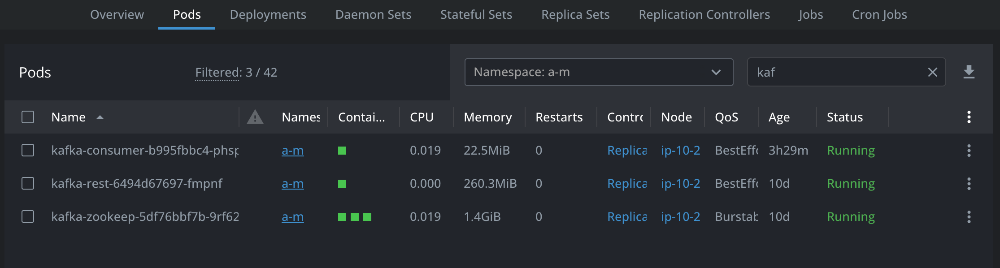
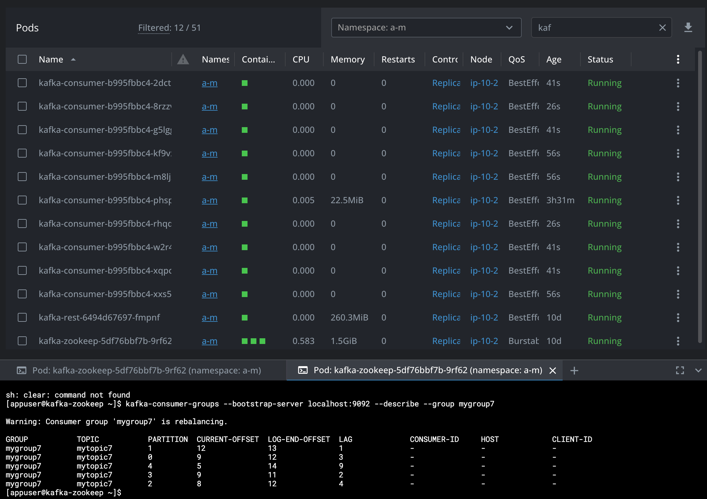

# KEDA

POC of KEDA v2.12 scaling a service (sample python app) on kafka consumer lag. 
- Scaling formula is supposed to be if `actual_value_of_metric / num_of_services >= threshold` then scale.
- Scalers are quite simple: https://github.com/kedacore/keda/blob/main/pkg/scalers/kafka_scaler.go#L843

Before:



Add some load:
- Overall lag is 1+3+9+2+4 = 19. With threshold=2 it gives 19/2 = 9 more replicas



5 min later (HPA's default stabilization window for scaling down):


And eventually will go down to just 1


## Install

As of Nov 2023, KEDA in master was broken, apparently :|

Just edit directly in k8s if not set, or set during helm install, or when installing from sources:
```bash
# install from sources
$ git clone https://github.com/kedacore/charts.git
$ helm install keda . --values values.yaml --namespace a-m --set metricsServer.dnsPolicy=ClusterFirst,metricsServer.useHostNetwork=true

# uninstall
helm list -n a-m
helm uninstall keda -n a-m
# check keda CRDs and delete metadata.finalizers for ScaledObjects 
# https://keda.sh/docs/2.12/deploy/#uninstall
```

Anyways ensure the following is set:
```
keda-operator
  dnsPolicy: ClusterFirstWithHostNet
  hostNetwork: true
  port 9666 expose
 
metrics-server
  dnsPolicy: ClusterFirstWithHostNet
  hostNetwork: true
```

Make sure to check logs for:
```
keda_metrics_adapter/provider "msg"="Connection to KEDA Metrics Service gRPC server has been successfully established" "server"="keda-operator.a-m.svc.cluster.local:9666"
```


## Build and deploy

```bash
# build image on apple chip
cd app
docker build -t keda-test:7 --platform linux/amd64 .
docker push keda-test:7

# check locally
docker-compose up

# deploy
k create -f deployment.yml
k apply -f scaled-object.yaml
```
This will also create HPA with the following:
```yaml
apiVersion: autoscaling/v2
kind: HorizontalPodAutoscaler
spec:
  scaleTargetRef:
    name: kafka-consumer
  minReplicas: 1
  maxReplicas: 100
  metrics:
    - type: External
      external:
        metric:
          name: s0-kafka-mytopic1       # Exposed by keda-metrics-apiserver
          selector:
            matchLabels:
              scaledobject.keda.sh/name: kafka-consumer-keda-scaled-object
        target:
          type: AverageValue                   
          averageValue: '2'
```


## Check metrics

- HPA from above refers to the new metric exposed - `"s0-kafka-mytopic1"`
```bash
# metrics of a particular pod
$ k get --raw /apis/metrics.k8s.io/v1beta1/namespaces/a-m/pods/kafka-consumer-cd755584f-jhdkr

$ k get scaledobject kafka-consumer-keda-scaled-object -n a-m -o jsonpath={.status.externalMetricNames}
["s0-kafka-mytopic1"]%

# external metrics should appear in logs
$ kubectl get --raw "/apis/external.metrics.k8s.io/v1beta1/namespaces/a-m/s0-kafka-mytopic1?labelSelector=scaledobject.keda.sh%2Fname%3Dkafka-consumer-keda-scaled-object" | jq
{
  "kind": "ExternalMetricValueList",
  "apiVersion": "external.metrics.k8s.io/v1beta1",
  "metadata": {},
  "items": [
    {
      "metricName": "s0-kafka-mytopic1",
      "metricLabels": null,
      "timestamp": "2023-11-15T18:04:43Z",
      "value": "0"
    }
  ]
} 
```

## Add some Kafka traffic
```bash
# create topic 
kafka-topics --bootstrap-server localhost:9092 --create --topic mytopic1 --partitions 5 --replication-factor 1
# delete topic 
kafka-topics --bootstrap-server localhost:9092 --delete --topic mytopic2

# note that consumer will fail given smth not deserializable
echo '{"foo":"bar"}' | kafka-console-producer --broker-list localhost:9092 --topic mytopic1
# add some load
for i in {1..20}; do echo {\"foo\":\"baz-$i\"} | kafka-console-producer --broker-list localhost:9092 --topic mytopic1; sleep 0.5; done

# describe group to check lag
kafka-consumer-groups --bootstrap-server localhost:9092 --describe --group mygroup1
```
and see how it scales
