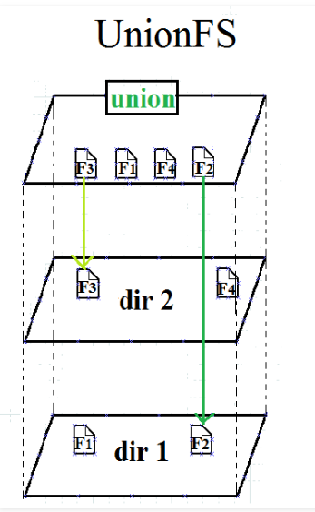

# Union FS



- Overlay implements UnionFS
- the following won't run in docker because of overlay-on-overlay
    - on Mac for some other reason
- Better try it on AWS EC2:

Prepare the following structure:
```bash
mkdir union && cd union

mkdir lower upper work merged

root@b440d7450b9c:/home/union# cat lower/code.py 
print('hi im from the lower dir')

root@b440d7450b9c:/home/union# cat lower/script.py 
print('im just a script')

root@b440d7450b9c:/home/union# cat upper/code.py 
print('hi im the code from the upper one')

root@b440d7450b9c:/home/union# cat upper/config.yaml 
spring:
  profiles:
    active: dev
```

This is how you do the overlay mounting:
```bash
mount --types overlay overlay --options lowerdir=lower,upperdir=upper,workdir=work ./merged
```
- lowerdir are read-only layers
- upperdir is responsible for write
- workdir is just an intermediate one
- result is merged into `./merged`
- conflict resolved from left to right, upper one takes advantage


Result:
```bash
tree .
.
├── lower
│    ├── code.py
│    └── script.py
├── merged
│    ├── code.py
│    ├── config.yaml
│    └── script.py
├── upper
│    ├── code.py
│    └── config.yaml
└── work
    └── work

# in case of conflict, the upper one takes advantage
cat merged/code.py 
print('hi im the code from the upper one')
```

Now let's add file to see how write level works:
```bash
cd merged
touch duck

# once more
tree .
.
├── lower
│    ├── code.py
│    └── script.py
├── merged
│    ├── code.py
│    ├── config.yaml
│    ├── duck
│    └── script.py
├── upper
│    ├── code.py
│    ├── duck
│    └── config.yaml
└── work
    └── work
```

The file was propagated into the write level


---

Let's see the same in docker:
```bash
docker pull nginx
> abc123
docker inspect abc123
```

```json
"GraphDriver": {
    "Data": {
        "LowerDir": "/var/lib/docker/overlay2/b0709ad24a405b9552b2a294464d9fec65f40d617292a13aa16d236dc786dbb1-init/diff
                      :/var/lib/docker/overlay2/c50be2659c57e440287226de633e5bcb731d4b2405f8bd1c5ecffc42732af1c0/diff
                      :/var/lib/docker/overlay2/86e8c52dccbfe3b293368fba273df5fbce791456caed1ee06768c56cfec82863/diff
                      :/var/lib/docker/overlay2/1c567eeeb8910064aee4e216284065ecd9a7d037136af99612c9c8f9076be425/diff",
        "MergedDir": "/var/lib/docker/overlay2/b0709ad24a405b9552b2a294464d9fec65f40d617292a13aa16d236dc786dbb1/merged",
        "UpperDir": "/var/lib/docker/overlay2/b0709ad24a405b9552b2a294464d9fec65f40d617292a13aa16d236dc786dbb1/diff",
        "WorkDir": "/var/lib/docker/overlay2/b0709ad24a405b9552b2a294464d9fec65f40d617292a13aa16d236dc786dbb1/work"
    },
    "Name": "overlay2"
}
```


А вот как он [это делает](https://github.com/moby/moby/blob/1ef1cc8388165b2b848f9b3f53ec91c87de09f63/daemon/graphdriver/overlay2/overlay.go#L580)
```golang
opts := fmt.Sprintf("lowerdir=%s,upperdir=%s,workdir=%s", strings.Join(absLowers, ":"), path.Join(dir, "diff"), path.Join(dir, "work"))
mountData := label.FormatMountLabel(opts, mountLabel)
mount := unix.Mount
mountTarget := mergedDir
```

Никакой магии


взято из:
- https://habr.com/ru/company/skillfactory/blog/547116/
- https://wiki.archlinux.org/index.php/Overlay_filesystem_(%D0%A0%D1%83%D1%81%D1%81%D0%BA%D0%B8%D0%B9)
