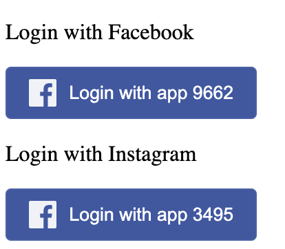
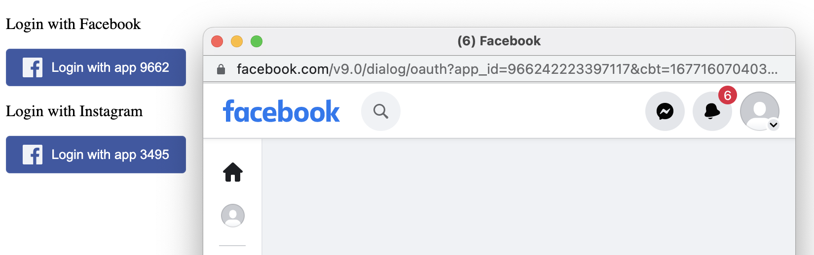
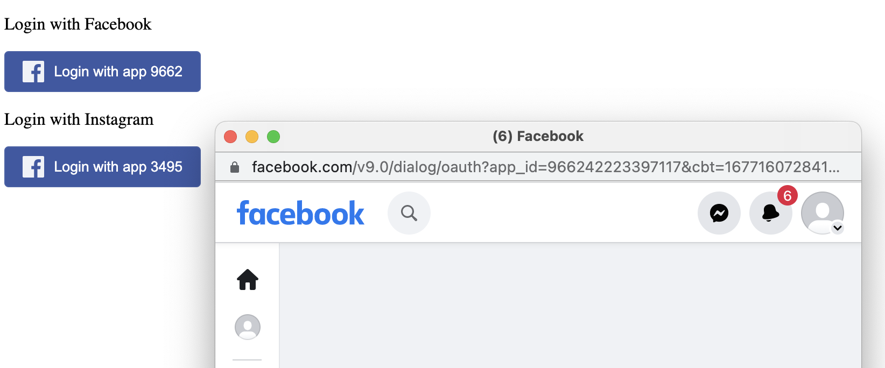

# Vue multiple Facebook login buttons issue

Install and run:
```bash
npm install
npm run dev
```

`"vue-facebook-login-component": "^4.0.2"` is used

Login buttons are supposed to use separate login options and have different app IDs:
- 966242223397117 for Facebook
- 349506013672626 for Instagram



But whichever buttons gets rendered first, the same app IDs gets stuck for both of them.

Say you click on Facebook login - you'll get the popup with `app_id=966242223397117`


And if you click on Instagram login - you'll get the same app_id while the expected one is `349506013672626`


If you reorder them in [FacebookButtons.vue](./src/components/FacebookButtons.vue), then you'll keep getting the ID from the one which is on top

---

### Another example

If you move them to separate views, say 1 button per view
- view-1, button-1, `app_id=foo`
- view-2, button-2, `app_id=bar`

Whichever gets clicked first, has it's ID stuck
- So if you navigate on view-1 first and click button-1, you'll get the `app_id=foo`
- Now if you navigate the view-2 and click on button-2, you'll get the same `app_id=foo`
- But if you **refresh browser** on view-2 and click once more, you'll get proper `app_id=bar`
- But if you navigate back to view-1, you'll still get `app_id=bar` while you wanted `foo`

Which may be due to unmount/unload issues
