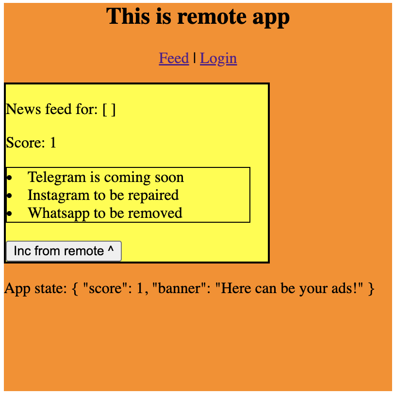
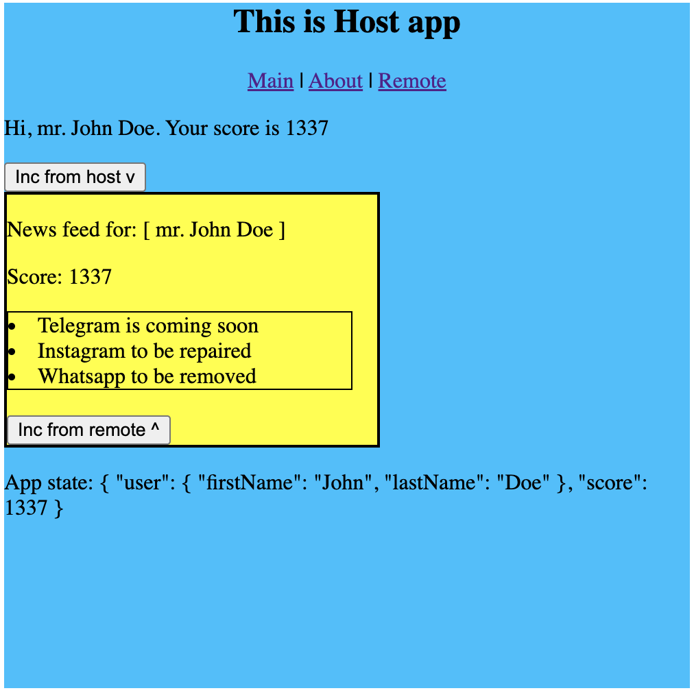

# MicroFrontends Vue

```
    ---------------------             ---------------------
    |     Host app      |             |     Remote app    |
    |                   |             |                   |
    |    ( store )      |----imports------->[ Feed ]      |
    |        ^          |             |   [ LoginView ]   |
    |        |          |             |                   |
    --------- \ ---------             ---------------------
               \______peeks_at_host_store_______/

```

## Remote app
- exports news feed



## Host app
- imports news feed from remote app




## Links
useful
- https://medium.com/geekculture/implementing-webpacks-module-federation-in-a-vue-2-application-38997c696094
- https://github.com/module-federation/module-federation-examples/blob/master/vue-cli/core/vue.config.js
- https://stackblitz.com/github/webpack/webpack.js.org/tree/main/examples/module-federation?file=app2%2Fwebpack.config.js&terminal=start&terminal=

state:
- https://www.digitalocean.com/community/tutorials/how-to-manage-state-in-a-vue-js-application-with-vuex

- good guy
  - https://www.youtube.com/watch?v=njXeMeAu4Sg&t=356s
  - and vue shared store https://www.youtube.com/watch?v=LAu1p6tmj_Y&t=1564s

## ne rabotaet
- стор внутри ремоут аппа не виден из хост аппа. может бай дизайн а может можно увидеть